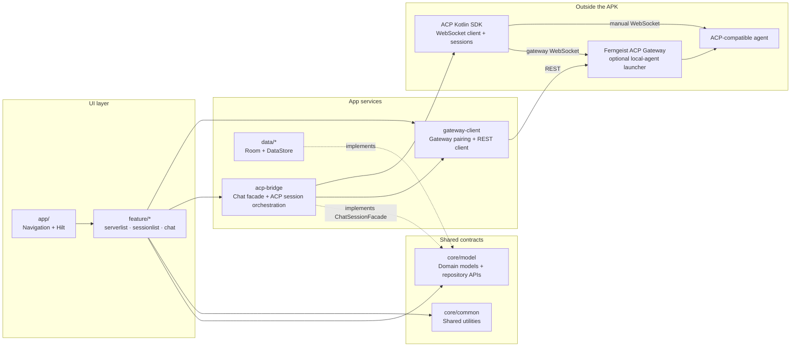

# Ferngeist

[](https://opensource.org/licenses/MIT)
[](https://github.com/arafatamim/ferngeist/releases/latest)

> **Starting September 2026, a silent update pushed by Google will block every Android app whose developer hasn't registered, signed Google's contract, paid up, and handed over government ID.**
>
> If you care about the open Android ecosystem, visit [Keep Android Open](https://keepandroidopen.org) to learn more.

Ferngeist is an Android client for [ACP](https://agentclientprotocol.com/)-compatible coding agents, paired with an optional [Ferngeist ACP Gateway](https://github.com/arafatamim/ferngeist-acp-gateway) that auto-detects local agents and exposes a single authenticated endpoint to the app.

## Download

Ferngeist is currently in **closed testing** on Google Play. To install:

1. Join the tester group: [ferngeist-testers](https://groups.google.com/g/ferngeist-testers)
2. Opt-in to the test: [ferngeist on Play Store (testing)](https://play.google.com/apps/testing/com.tamimarafat.ferngeist)
3. Download:

<a href="https://play.google.com/store/apps/details?id=com.tamimarafat.ferngeist"></a>

Alternatively, download the APK from [GitHub Releases](https://github.com/arafatamim/ferngeist/releases/latest) (manual updates only — Play Store is recommended for auto-updates).

## Screenshots


## Usage
Two ways to add ACP agents:
### 1. Ferngeist Gateway (optional, for local agents) — available for Windows and Linux:

1. Download the [latest gateway release](https://github.com/arafatamim/ferngeist-acp-gateway/releases/latest) for your platform.
2. Extract and run:
   ```powershell
   .\ferngeist-gateway.exe daemon install  # Windows: run as Administrator
   .\ferngeist-gateway.exe pair            # displays a pairing code
   ```
3. Open Ferngeist on your Android device, tap **Add server**, and enter the tunnel URL with the pairing code.

#### Exposing via tunnel

The daemon listens on `127.0.0.1:5788`. To reach it from a mobile device on a different network:

**ngrok:**
```powershell
ngrok http 5788
# Note the HTTPS URL (e.g. https://xxxx.ngrok.io)
.\ferngeist-gateway.exe daemon install --public-url https://xxxx.ngrok.io
```

**Cloudflare Tunnel:**
```powershell
cloudflared tunnel --url http://localhost:5788
# Note the URL (e.g. https://xxxx.trycloudflare.com)
.\ferngeist-gateway.exe daemon install --public-url https://xxxx.trycloudflare.com
```

Then pair and add the tunnel URL as the server host in Ferngeist:

```powershell
.\ferngeist-gateway.exe pair
```

For detailed configuration, see the [Ferngeist Gateway docs](https://github.com/arafatamim/ferngeist-acp-gateway).

### 2. Add an ACP server manually
Most ACP agents only support `stdio` transport — wrap with a WebSocket bridge first. Check the agent's docs for the correct flags to start in ACP mode.

Example:
```powershell
npx -y stdio-to-ws "npx @qwen-code/qwen-code@latest --acp" --port 8769
```

Then add `ws://<your-pc-ip>:8769` in Ferngeist as the server host.

## Supported Agents

Any agent implementing [ACP](https://agentclientprotocol.com/), including Codex CLI, Claude Code, Gemini CLI, GitHub Copilot CLI, and OpenCode. See the [full list](https://agentclientprotocol.com/get-started/agents).

## Tech Stack

- Kotlin 2.3 / Jetpack Compose + Material 3
- Hilt / Room / Kotlin Coroutines and Flow / KSP
- ACP Kotlin SDK

Requires Android 13+ (`minSdk = 33`).

## Build

```powershell
cmd /c gradlew.bat :app:assembleDebug
```

## Architecture



**Key data flow:**
1. `app/` owns navigation and Hilt bindings, then routes users into the feature modules.
2. Feature modules render Compose UI and depend on `core/model` contracts instead of persistence details.
3. `data/*` provides the local Room/DataStore implementations for saved servers, gateway bindings, and preferences.
4. `acp-bridge` implements `ChatSessionFacade`, manages ACP connections/sessions, and converts SDK callbacks into app events.
5. `gateway-client` handles pairing and gateway REST calls; the bridge uses it when a chat starts from a gateway-backed agent.
6. Manual servers connect directly to an ACP agent through the SDK, while gateway-backed agents go through the optional Ferngeist ACP Gateway first.

## Project Structure

```
app/                  Android entry point, navigation, theme, DI
acp-bridge/           ACP transport, connection manager, session bridge
core/common/          Shared UI helpers and utilities
core/model/           Domain models and repository interfaces
data/database/        Room database, DAOs, entities
feature/serverlist/   Saved server management UI
feature/sessionlist/  Session listing and creation
feature/chat/         Streaming chat UI, reducers, markdown state
gateway-client/       Ferngeist ACP Gateway HTTP client
gradle/               Version catalog
```

## Reporting Issues
Bug reports and feature requests welcome on [GitHub Issues](https://github.com/arafatamim/ferngeist/issues).

## Further Reading
- [Introduction to Agent Client Protocol](https://agentclientprotocol.com/get-started/introduction)
- [Jetpack Compose](https://developer.android.com/compose)

## License

MIT. See [LICENSE](LICENSE).

## Privacy Policy

See [Privacy Policy](docs/privacy_policy.md).
